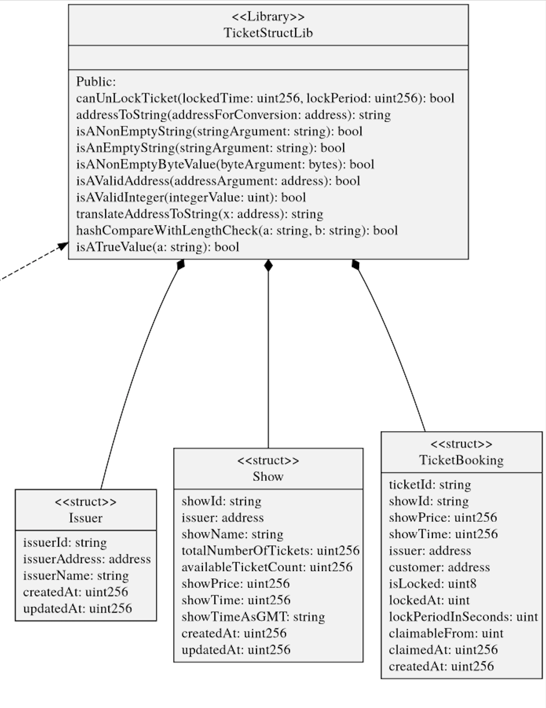
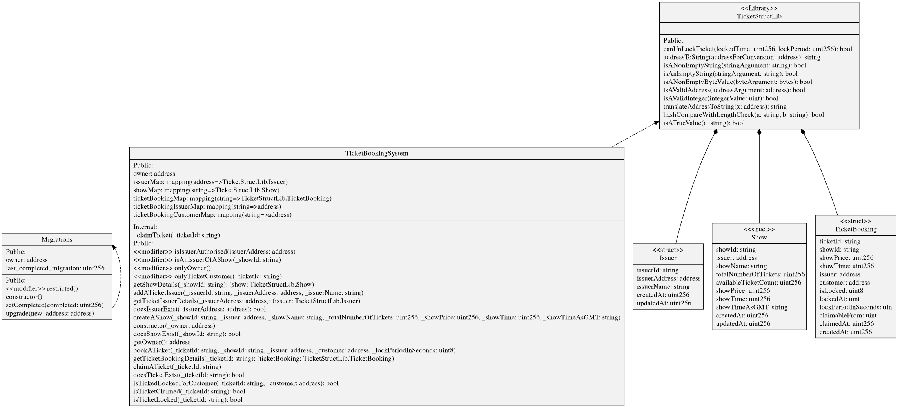

# Online Ticket Booking System -Smart Contracts

## Requirements:

1. ticket issuers should be able to add new movies , Other shows with the price & date information for the show.
2. Ticket buyers should be able to book a movie/show based on its availability and date.
3. Ticket checkers at the venue should be able to verify the ticket online.

- Create a Time Locked Smart Contract on kovan network
- Contract allows the owner to lock a movie ticket for an user for a certain interval of time
- After the lock time, receiver can claim the ticket.

### Design Considerations:

- There should be a single smart contract where tickets are locked for every user
- Not a smart contract for each user.

### Functional Constrains:
- Claim Ticket operation will be done by the user only after the lock period is over.
- Make the claim operation native meta transaction enabled so claim operation can be done via meta transaction also.


## UML Design:

### DataStruct:



### Contract UML:




## Tech References:

- Time Units in Solidity: https://docs.soliditylang.org/en/v0.6.0/units-and-global-variables.html#time-units

- Time Units

```
Suffixes like seconds, minutes, hours, days and weeks after literal numbers can be used to specify units of time where seconds are the base unit and units are considered naively in the following way:

        1 == 1 seconds
        1 minutes == 60 seconds
        1 hours == 60 minutes
        1 days == 24 hours
        1 weeks == 7 days

Take care if you perform calendar calculations using these units, because not every year equals 365 days and not even every day has 24 hours because of leap seconds. Due to the fact that leap seconds cannot be predicted, an exact calendar library has to be updated by an external oracle.
```

- Note

```
The suffix years has been removed in version 0.5.0 due to the reasons above.

These suffixes cannot be applied to variables. For example, if you want to interpret a function parameter in days, you can in the following way:
```

```js
function f(uint start, uint daysAfter) public {
    if (now >= start + daysAfter * 1 days) {
      // ...
    }
}
```
